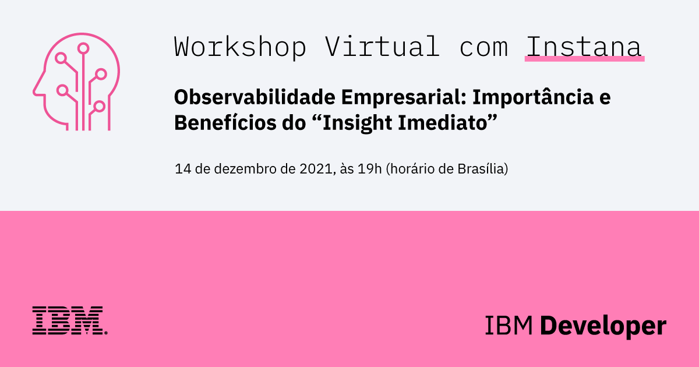
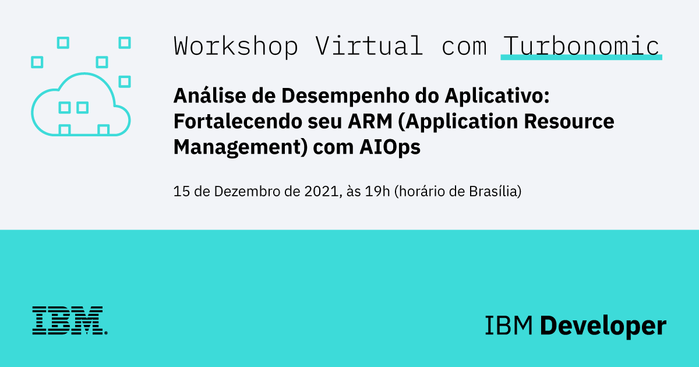

# IBM & Instana apresentam: A Observabilidade Empresarial: Importância e Benefícios do "Insight Imediato"

Neste webinar exclusivo, discutimos as principais diferenças entre o monitoramento (simples) e a observabilidade (corporativa), aprofundando nas perguntas e respostas a serem respondidas pelos insights de observabilidade do nosso aplicativo baseado em microsserviços.

## Links da sessão: 
1. Conta gratuita na IBM Cloud: <https://ibm.biz/BdfA8V>
2. Replay da sessão: <https://www.crowdcast.io/e/ibm--instana-apresentam>
3. Instana Free Trial : <https://www.instana.com/trial/>

## Speakers
* [Rafael Todesco](https://www.linkedin.com/in/rafaeltodesco/), mediador, IBM Developer Advocate; 
* [Felipe Freire](https://www.linkedin.com/in/felipefreire/) – AIOps & Management Sales Latin America @ IBM;
* [Fernando Sanches](https://www.linkedin.com/in/fesanches/) – Senior Technical Sales Engineer @ Instana.

## Leituras Recomendadas
* [Code Pattern: Monitore a performance de sua aplicação de microsserviços](https://developer.ibm.com/br/patterns/integrating-instana-with-microservice-app-on-openshift/)
* [O que os desenvolvedores devem saber sobre Observabilidade (EN)](http://%20https//drive.google.com/file/d/1vIKUriKKzsIq25kVKs-b-IhRTdEFDhPR/view)
* [Observabilidade IBM por Instana](https://www.ibm.com/br-pt/cloud/instana)
* [Experimente a Instana](https://www.instana.com/apm-observability-sandbox/)
* [Documentação da Instana](https://www.instana.com/docs/pt-BR/)
* [Bee Travels](https://bee-travels.github.io/)
* [Instana Robot Shop (EN)](https://github.com/instana/robot-shop)

--------------------------

# IBM & Turbonomic apresentam: Análise de Desempenho do Aplicativo: Fortalecendo seu ARM (Application Resource Management) com AIOps (Parte 2)

Nesta sessão, fazemos um mergulho técnico profundo para destacar como o AIOps fornece a aplicativos altamente distribuídos e dinâmicos os recursos de que eles precisam para executar com ARM. AIOps é a seção transversal de observabilidade e capacidade de ação, que ajuda os clientes a automatizarem para se concentrar na inovação e fornecer as melhores experiências ao cliente.

## Links da sessão
Replay da sessão: <https://www.crowdcast.io/e/ibm--turbonomic-2>

## Speakers
* [Rafael Todesco](https://www.linkedin.com/in/rafaeltodesco/), mediador, IBM Developer Advocate; 
* [Felipe Freire](https://www.linkedin.com/in/felipefreire/) – AIOps & Management Sales Latin America @ IBM;
* [Lucas da Silva](https://www.linkedin.com/in/ludas/) – Regional Sales Director, LATAM.

## Leituras Recomendadas
* [Digital Developer Conference - AIops & Integration](https://developer.ibm.com/conferences/digital-developer-conference-ai-automation-integration/)
* [Melhorando a performance e eficiência em suas implementações Red Hat Openshift TBD](https://developer.ibm.com/br/tutorials/improve-performance-efficiency-openshift-deployments-turbonomic-instana/)
* [Turbonomic Application Resource Management para IBM Cloud Paks](https://www.ibm.com/br-pt/cloud/turbonomic)

## Recursos
* [Red Hat OpenShift na IBM Cloud](https://developer.ibm.com/br/components/redhat-openshift-ibm-cloud/)
* [GRÁTIS - Curso IBM Cloud Essentials](https://cognitiveclass.ai/courses/ibm-cloud-essentials)
